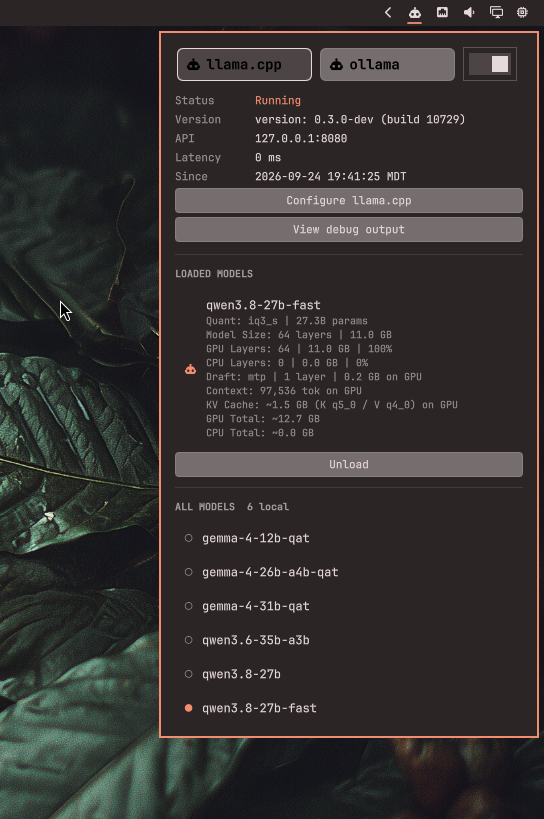

# omarchy-local-ai-dashboard



Monitor and control local AI model services like ollama and llama.cpp from the Omarchy bar. Start and stop systemd background services, view available models with current status, monitor CPU/GPU/DRAM/VRAM usage, stream debug output via a new terminal session, and open config files directly in nvim.

It provides a unified interface for various local backends—including `ollama` and `llama-server`—allowing you to inspect models, adjust service setups, stream terminal logs, and enforce single-service resource isolation. Support for `vLLM` is a planned feature.

This project is an extended derivative work based on `omarchy-ollama-status` by LinuxGamerUK.

> **For contributors and AI tooling:** this README is the authoritative contract for
> modifying the plugin — no separate `AGENTS.md` is maintained. It covers the
> [llama.cpp service architecture](#design-documentation), the [Testing contract](#testing), [Development Conventions](#development-conventions),
> and the [Contributing](#contributing) branch flow. Keep all guidance consolidated;
> never contradict it.

---

## Plugin Identification

- **Plugin Name:** `local-ai-dashboard`
- **Full Identifier:** `kevano.local-ai-dashboard`
- **Target Platform:** Omarchy 4 (Quattro / Quickshell Engine)

---

## Project Structure

The plugin is split into a `Dashboard.qml` shell that owns all shared state
(backend selection, cursor and keyboard navigation, `Service` instances) plus a set
of reusable UI components and per-section files. Each section is "state-in /
signal-out": it receives data as properties and reports interactions back as
signals, so the shell remains the single source of truth.

```
kevano.local-ai-dashboard/
├── assets/                          # Static assets (icons, etc.)
├── configs/                         # Per-backend configuration files
│   ├── llama.env                    #   llama.cpp env template / config
│   └── ollama.json                  #   ollama JSON config
├── docs/                            # Design documentation (llama.cpp tier system)
├── sections/                        # Dashboard section components
│   ├── HeroSection.qml              #   Backend cards + power toggle
│   ├── ServiceDetailsSection.qml    #   Status/version/API grid + configure buttons
│   └── ModelsSection.qml            #   Running + available model lists
├── ui/                              # Reusable UI components
│   ├── BackendCard.qml              #   Clickable backend selector card
│   ├── InfoLabel.qml                #   Dimmed detail-row label
│   ├── InfoValue.qml                #   Detail-row value text
│   └── SettingsButton.qml           #   Full-width config action button
├── BarWidget.qml                    # Bar icon button (the plugin entry point)
├── Controller.qml                   # Loads and wires the dashboard panel
├── Dashboard.qml                    # The panel shell: structure + shared state
├── Service.qml                      # Backend service model (systemctl/API logic)
├── LICENSE
├── manifest.json                    # Plugin metadata + entry point declaration
├── tests/                           # Hermetic test suite (unit, integration, e2e)
│   ├── run_all.sh                   #   Orchestrates all test phases
│   ├── unit_tests/                  #   8 QML harnesses (561 assertions)
│   ├── integration_tests/           #   9 BATS files (66 tests)
│   └── e2e_tests/                   #   7 sandbox lifecycle harnesses (120 assertions)
└── README.md
```

`manifest.json` points the bar at `BarWidget.qml` (`entryPoints.barWidget`), which
registers a `Controller` that loads `Dashboard.qml` on demand. Both the
`Service.qml` model and the `qs.Ui` panel primitives (`Panel`,
`KeyboardPanel`, `CursorSurface`, etc.) are reused across the sections.

---

## Design Documentation

The llama.cpp backend uses a **six-tier acquisition ladder** to resolve every displayed value through a demand-driven orchestrator that asks the cheapest definitive source first, keeps asking while a question is genuinely unanswered, and lets direct system observation overrule predictions. The ollama backend uses a separate, simpler model: all values come directly from the engine (`ollama ps`, `ollama list`) and are treated as exact — there is no tier ladder, field store, or resolver for ollama.

The full architectural design is documented in [`docs/`](docs/). This section provides a quick overview; see the linked files for complete specifications.

### Six-tier acquisition ladder (llama.cpp only)

| # | Tier | Cost | Role | Status | Mechanism |
|---|---|---|---|---|---|
| 1 | Server API | ~5 ms | definitive | active | `GET /v1/models` incl. `status.args`, plus `GET /slots` for resolved `n_ctx` |
| 2 | Model file (GGUF header) | ~15 ms | definitive | active | bounded 16 KiB header read — provides `totalLayers`, shape, quant |
| 3 | Preset config | ~5 ms | definitive | active | `models.ini` section over `[*]` globals — acquires the raw `n-gpu-layers` token; the split is derived |
| 4 | System observation | ~20 ms | definitive | active | per-PID GPU memory + cgroup `anon+shmem` — hardware truth for placement |
| 5 | Engine projection | ~555 ms | **permanently approximate** | planned | `llama-fit-params --fit off --fit-print on -ngl N` — per-device byte breakdown, integer MiB |
| 6 | Deep engine observation | 3–45 s | definitive | planned | `llama-cli --verbose` oracle — last resort for undescribable shapes |

**Status** records what exists in the tree today, not what the design allows. Tiers
1–4 are the current implementation; 5 and 6 are specified in
[`concern-3-p1-plan.md`](concern-3-p1-plan.md) and
[`concern-1-p0-plan.md`](concern-1-p0-plan.md) and are not built. The current code
estimates the KV shape from the header and reads placement from cgroup/VRAM, so
there is no 3–45 s probe in the shipped panel.

Tier 5's *Status* is separate from its certainty, and the difference is load-bearing:
it is not built, and when it is built it will still be `~` forever. `llama-fit-params`
prints **integer MiB**, so the projection has already discarded up to ~1 MiB per cell
before it is printed. A later tier confirming it could only agree, never upgrade — so
no confirmation tier exists or is planned
([`concern-4-p2-plan.md`](concern-4-p2-plan.md)).

**Key design points:**

- **Derivation is not a tier.** It is exact arithmetic over whatever the tiers hold, running after each tier commits. For a model whose KV shape the GGUF header fully describes, the walk never spawns tier 5.
- **Nothing arbitrates anything.** Every rung holds a reading; the ladder picks the *strongest available* one and the display states its certainty. There is no cross-tier conflict resolution, because a rung that cannot answer declares so rather than answering badly. A tier that cannot answer is *absent* (`—`), not zero and not a guess.
- **Walk order is `[1, 2, 3, 4, 5, 6]`.** The order is by the **quality and speed of the values held**, not by dependency. Tiers are independent: the derivation that turns a layer count into a split is *retried* on every settle rather than scheduled, so no tier has to run before another for the arithmetic to resolve.
- **Certainty markers:** `exact` (unmarked), `~` (estimate or derived over a model of reality), `…` (pending: in flight at a named tier), `—` (absent: looked everywhere, cannot be had). `…` and `—` are deliberately distinct — the first is "not yet", the second is "looked, and no" — and the store keeps them apart so neither has to be inferred from a `-1` sentinel.
- **An architecture is read through a key template, and an unknown one degrades to a decline rather than a guess.** GGUF keys are prefixed with the architecture namespace, so hardcoding `llama.block_count` reads nothing from `Qwen3.6-35B-A3B-UD-IQ4_XS.gguf`, which reports `general.architecture = qwen35moe` and carries `qwen35moe.block_count = 40` but no `llama.*` keys at all. That is the regression this design exists to prevent. The derivation therefore resolves keys through a per-namespace suffix template; a namespace with no template yields no shape, the field is `—`, and tier 6 answers it if it can. A uniform-layer assumption applied to an unrecognised layout would produce an authoritative-looking wrong number, which is worse than no number.

### Documentation files

| File | Purpose |
|---|---|
| [docs/llama-service-tiers-overview.md](docs/llama-service-tiers-overview.md) | **Start here.** Governing principles, all six tiers at a glance, resolver logic, certainty rules, lifecycle. |
| [docs/llama-service-tier-1-server-api.md](docs/llama-service-tier-1-server-api.md) | `GET /v1/models` + resolved `status.args` command line parsing. |
| [docs/llama-service-tier-2-gguf-header.md](docs/llama-service-tier-2-gguf-header.md) | Bounded 16 KiB GGUF header read. Provides `totalLayers`, shape, quantization. |
| [docs/llama-service-tier-3-preset-config.md](docs/llama-service-tier-3-preset-config.md) | `models.ini` preset, section over `[*]` globals. Resolves `n-gpu-layers` intent to a split. |
| [docs/llama-service-tier-4-system-observation.md](docs/llama-service-tier-4-system-observation.md) | cgroup `anon+shmem` and per-PID GPU memory. The authoritative tier. |
| [docs/llama-service-tier-5-engine-projection.md](docs/llama-service-tier-5-engine-projection.md) | `llama-fit-params --fit-print on` per-device decomposition. |
| [docs/llama-service-tier-6-deep-engine-observation.md](docs/llama-service-tier-6-deep-engine-observation.md) | `llama-cli --verbose` oracle and its parsers. Last resort. |
| [docs/llama-service-field-matrix.md](docs/llama-service-field-matrix.md) | Every value and every location variable, which tier answers it, certainty, and functions involved. |
| [`concern-1-p0-plan.md`](concern-1-p0-plan.md) … [`concern-5-p2-p3-plan.md`](concern-5-p2-p3-plan.md) | **The plan.** Field store and resolver, placement ladder, tier 5, declined corroboration, documentation and assertions. These five files replaced `docs/change-plan.md`, which has been removed. |

### How the docs relate

```
llama-service-tiers-overview.md     the model: principles, certainty, resolver
        │
        ├── llama-service-tier-1 … tier-6   one per rung:
        │                    what it answers, how the code works,
        │                    what it cannot answer
        │
        └── llama-service-field-matrix.md   the cross-product: field × tier × function

concern-1 … concern-5 (repo root)        the work: bugs, new build, change surface
        │
        └── supersedes the removed docs/change-plan.md
```

For the complete source ladder details — worked examples, anti-patterns, KV cache mechanics, and per-tier code locations — see the files above. The inline documentation below has been superseded by these detailed tier documents.

---

## Testing

The project ships a hermetic test suite under `tests/` that exercises QML logic,
shell scripts, and end-to-end workflows inside an isolated sandbox (no live
systemd or host configs touched). Run all phases from the repo root:

```bash
bash tests/run_all.sh
```

Individual phases:

- **Unit tests** (`tests/run_unit_tests.sh`) — 8 Quickshell harnesses (561 assertions) covering config parsing, defaults, exit-code maps, provisioning state, security contracts, input validators, and field derivation.
- **Integration tests** (`tests/run_integration_tests.sh`) — 66 BATS tests across 9 files, exercising the embedded bash scripts (config reader/writer, env writer, provision create flows, rollback/unsafe matrices) against mocked `systemctl` and `systemd-analyze`.
- **End-to-end tests** (`tests/run_e2e_tests.sh`) — 7 sandbox harnesses (120 assertions) covering llama.cpp full lifecycle, rollback on start failure, and Dashboard→section signal wiring.

These counts are derived, not typed: `tests/integration_tests/docs.bats` re-derives each one and fails naming the README line if it drifts. A contributor who adds a test and does not update this section gets a red test, which is the intended friction.

A detailed description of the test architecture, constant extraction process,
and how to add new tests is in [tests/README.md](tests/README.md).

`tests/.cache/` holds scratch artifacts (dumped constants, per-run logs, generated
BATS files) and is git-ignored — it is regenerated on every run. `scratch/`
contains local discovery notes from development and is also git-ignored; both
directories can be safely deleted without affecting the plugin.

**Contract:** every new source or field must (1) extend the Source Ladder matrix
and this README (the [anti-pattern list](#anti-patterns-do-not-reintroduce)
included), and (2) ship tests following the existing patterns:

- Pure derivation helpers → unit harness `tests/unit_tests/tst_derivation.qml`.
- GGUF / file parsing → generated fixture `tests/integration_tests/gguf_header.bats`
  (the `gen_gguf` python fixture is the single source of truth for the binary layout).
- Scripts embedded in `Service.qml` are dumped at run time
  (`tests/lib/extract_constants.sh`) — edit only the QML constant, never a duplicate.

---

## Contributing

Public changes are welcome. This repository uses a **staging → main** release
pipeline; `main` is the production branch and the repository's default (it is
also what `omarchy plugin add` / `git clone` pull, so unreleased work never
reaches installers). The flow:

1. **PR to `main`:** fork from `main` and open a pull request against `main`
   (not `staging`), so the diff is clean relative to production. Describe the
   change, and run `bash tests/run_all.sh` before submitting.
2. **Maintainer review & integration:** accepted PRs are **retargeted to
   `staging`** before merging — `staging` merges only via a pull request and is
   where all post-merge testing happens. If staging has conflicting unreleased
   work, the change may instead be integrated through an internal PR based on
   the current `staging`.
3. **Release:** once staging is stable, a local `git release` fast-forward
   merges `staging` into `main`, tags the new version (`vX.Y.Z`), and pushes
   both `main` and the tag. `main` never advances except by that fast-forward.

Branch roles:

- **`main`** — production / default. What installers receive. Fast-forward only.
- **`staging`** — integration / release-candidate mirror of `main` plus
  unreleased changes. PR-only merges.

---

## Development Conventions

Rules for anyone (human or agent) modifying the code:

- **QML + JS only** (no TypeScript).
- **Embedded bash scripts are constants with positional args only** — user data
  is never concatenated into them; API keys travel only in the child process
  environment or curl stdin (`curl -K -`), never in argv or on disk.
- **Every probe is bounded:** `timeout -k 2 N` + `head -c` output caps (`cap*`
  constants) + a QML watchdog timer.

---

## Features & Architecture

- **Dual systemd scope model:** ollama runs as a system-wide daemon (system instance, managed via `pkexec`), while llama.cpp runs as a per-user service (user instance, self-provisioned on first start with no root or polkit required). Both can run side-by-side independently.
- **Multi-Service Selection Bar:** Displays all installed or configured local AI services at a glance. Easily switch the target view without affecting active background processes. The bar icon is dimmed when no installed service has a systemd unit; otherwise it uses the normal foreground color.
- **Single-Active Service Enforcer:** Activating a service automatically initiates a graceful shutdown of any currently running backend and waits for complete resource/VRAM forfeit before starting the target engine.
- **Single-panel layout:** Hero cards at top for backend selection + power toggle, followed by a status/details grid and a model inventory list — all in one scrollable panel.
- **Interactive Terminal Debugging:** One-click action to launch a terminal attached to live systemd or process logs.
- **Inline Neovim Configuration:** View service config file locations and open them directly in Neovim for editing.

---

## Model Information Retrieval

### ollama — simple, exact

No separate ladder — the engine reports everything itself. Running models come from `ollama ps` (per-model size + the `processor` string, e.g. `51%/49% CPU/GPU`); the available list comes from `ollama list` (size, modified date, cloud flag). All values are engine-reported and treated as exact.

### llama.cpp — six-tier acquisition ladder

The llama.cpp backend resolves every displayed per-model value through a **six-tier acquisition ladder** described in detail in [Design Documentation](#design-documentation). The key principle: ask the cheapest definitive source first, keep asking while a question is genuinely unanswered, and let direct system observation overrule predictions.

For the complete specification — including worked examples, anti-patterns, KV cache mechanics, and per-tier code locations — see the tier documents in [`docs/`](docs/).

### Anti-patterns (do not reintroduce)

- **Total-GPU VRAM as a per-model proxy** — e.g. `nvidia-smi --query-gpu=memory.used`
  or DRM `mem_info_vram_used_total`. These count every process on the GPU.
  GPU memory is attributed only by summing the **per-PID** GPU contexts of the
  llama.cpp service processes (`nvidia-smi --query-compute-apps=pid,used_memory`
  / `rocm-smi --showpids`).
- **`memory.current` / systemd `MemoryCurrent` for the footprint** — both
  include reclaimable page cache, i.e. the mmap'd `.gguf` pages, double-counting
  weight pages already held as anon or on the GPU (a loaded 13 GB model reads
  ~17-18 GB of RSS, of which ~4 GB is really private). The cgroup `anon + shmem`
  working set excludes them, and is taken from the instance's own cgroup
  (`ControlGroup`, else `/proc/<pid>/cgroup`) so the per-model worker the preset
  router forks is still measured; `MemoryCurrent` is a last resort only.
- **An architecture table for anything** — no per-model KV periods, no "unknown
  arch → dense", no filename-sniffing architecture inference. llama.cpp owns
  those constants and changes them between releases (`gemma4` and the hybrids
  moved within months); a copied table is wrong the day it is written, and
  wrong *silently*. The dashboard reads what the file declares (an explicit
  `sliding_window_pattern` array or scalar, an explicit `sliding_window == 0`)
  and otherwise asks the engine. Unknown stays `—`.
- **KV cache shown as exact without having asked the engine** — the header sum is
  an upper bound and renders `~`: the server may default any externally-run
  `--cache-type/--ubatch/--parallel` flag to its own values. Unmarked is reserved
  for **Tier 6**, where llama.cpp printed the allocation it built.
- **Assuming "KV offload is enabled, so the KV is on the GPU"** — or, the
  subtler version, "every layer is on the GPU, so the cache must be too".
  A **fully** offloaded stack is not evidence about the cache: `--fit`,
  `--no-kv-offload`, the cache dtypes and the free VRAM all bear on it, and only a
  measurement decides. Naming `--fit` as the mechanism would assert an unverified
  cause — the measurement behind this claim showed host `anon+shmem` *above* the
  cache while per-PID VRAM was 13.5 GB, which cannot separate the cache from the
  CPU-resident weights. Placement is decided by `_kvPlacement` from flags and
  measurements, and it also decides which device's total the KV is added to.
  Unplaceable stays unattributed rather than being folded into a guess.
- **Capping the probe with `ulimit -v`** — virtual address space is not memory;
  llama.cpp's GPU backends reserve far more VA than RSS and the load dies with
  `mmap failed` on a machine with tens of GiB free.
- **Gating the whole probe fold on a clean exit** — the `llama_kv_cache: size`
  line and the `sched_reserve` line are not equally trustworthy, and treating
  them as one unit throws away correct answers. The size is fixed once the cache
  is allocated; the reserve is a promise about a graph that may never run. Only
  the reserve needs the exit status, and the device split that depends on it must
  not be invented from a dead run.
- **Letting the probe touch the GPU to measure a device-independent number.**
  `-ngl 0` alone still routes the compute reserve through `cudaMalloc`, which
  both perturbs the very VRAM the dashboard is reporting on and fails outright
  when the device is already occupied. `-dev none` costs nothing here.
- **Reading a `head_count_kv` entry of 0 as absent** — it is llama.cpp's
  declaration that the layer stores no KV, not a missing value. Falling back to
  the scalar silently charges a full context cache to layers that have none.
- **Guessing offload from VRAM math when a higher tier answered** — the layer
  split prefers the resolved `--n-gpu-layers` (Tier 1) and the explicit preset
  value (Tier 3). The measured-VRAM estimate (~, Tier 4) is used **only when
  neither Tier 1 nor Tier 3 provides `--n-gpu-layers`**, always from a per-PID
  reading, rounded to whole layers. When even that is unavailable, render `—`.
- **Guessing quant or params from the filename or `meta.size`** — the quant is
  an exact Tier-2 value read only from the GGUF header's `general.file_type`
  (mapped via `_ftypeLabel`), and params are an exact Tier-1 value read only
  from `meta.n_params`. Never derive them heuristically (file-name substrings,
  size ratios); `meta.size` is the aggregate file size and encodes no
  quantization. Unknown renders `—`.

---

## Interface Layout

### Header: Service Selector

The top header presents a horizontal row of available local services. Each service is represented by a single-column, two-row element:

```


+--------------+--------------+
| ollama       | llama.cpp    |
| RUNNING      | STOPPED      |
+--------------+--------------+

```

- **Selected View:** The currently selected service name is rendered in bold, bright text. Non-selected services are dimmed.
- **Interactive Selection:** Clicking any service column changes the active tab focus below to that service. Inspecting a service in this manner does not alter its running state.

---

### Lower Section: Three-Part Vertical Layout

The lower section is divided into three stacked components in a single scrollable panel.

#### Hero Section: Backend Cards + Power Toggle

Two clickable backend selector cards display the current status of each available service, alongside a power toggle switch for the active backend.

#### Service Details Grid

Displays operational information for the currently selected service in a two-column grid. When conditions warrant, error notices and config warnings appear above the grid:

- **Status:** `RUNNING` or `STOPPED`
- **Version:** Version string reported by the engine
- **API:** The host and port the service is serving on (shown when running)
- **Latency:** API response latency in milliseconds (shown when reachable, color-coded)
- **Since:** Timestamp of when the service was started

Conditional buttons:

- **Configure [Backend]:** Opens the service's config file in Neovim for editing (only visible when a config file exists)
- **View debug output:** Spawns a terminal attached to live systemd logs (only available when running)
- **Create [Backend] config file:** Generates the default config file (only shown when no config exists yet)

When starting llama.cpp requires writing or updating its systemd unit, a consent flow appears with "Confirm unit update & start" and "Cancel" buttons. This request also expires automatically after ~20 seconds.

#### Model Inventory

Displays an itemized list of all local models recognized by the selected service engine. When the service is running, loaded models appear at the top with detailed telemetry; below them, all available models are listed with indicators for cloud models and running status.

**Loaded model detail (llama.cpp):** Each loaded model renders as a multi-line block:

- **Model Size:** Layer count and total file size (base + draft)
- **GPU Layers / CPU Layers:** Per-device layer counts, weight GB, and percentage of the main stack on that device. A `(+N MTP ~X MB)` suffix appears when MTP draft layers are present.
- **Context:** Context length with location indicator (`on GPU` or `on CPU`)
- **KV Cache:** Estimated KV cache size with dtype info (e.g., `K f16 / V f16`) and location. Both the Context and KV lines share one placement decision: `--no-kv-offload` pins it to the host, otherwise the measured per-PID VRAM must show a KV-sized excess over the estimated GPU weights for it to be called `on GPU`. Omitted when unknown.
- **Quant / Params:** First row (`Quant: q4_k_m | 30.5B params`), shown above Model
   Size whenever the quant (from the GGUF header's `general.file_type`, Tier 2) or
   the param count (`meta.n_params`, Tier 1) is known. Both are exact — no `~`.
   Each unknown shows `—`; the whole line is omitted when none are known.
- **GPU Total / CPU Total:** Combined weight + co-located KV cache per device (shown when applicable)

When the preset sets no explicit `--n-gpu-layers`, layer counts and percentages fall back to a `~` estimate **derived** from measured per-PID VRAM (Tier 4) and the header's layer count (Tier 2), and show `—` only when even that is unavailable; the weight GB follows the same split, and is `~` by construction even when every input is exact — the arithmetic is a division, the *equal-layer* model of it is the approximation. The KV cache size is the engine's own accounting when `llama-cli --verbose` can be asked (**Tier 6**, not built yet — a 3–45 s run per model, rendered without `~`), and otherwise a `~` upper bound: a per-layer sum over the model's GGUF header (`_buildKvLayers`), so hybrid architectures — per-layer `head_count_kv`, sliding-window layers, recurrent/shared layers, MLA — are sized the way llama.cpp allocates them rather than as a uniform product. A model whose header declares no usable SWA shape and whose probe could not run shows `—` rather than a guess.

For the full precedence ladder, the exact source of every value, and the
anti-pattern rules, see [Design Documentation](#design-documentation).

**Loaded model detail (ollama):** A single-line summary showing memory footprint and CPU/GPU split: `"Memory: X.X GB | CPU: Y% | GPU: Z%"`, parsed from the engine's `processor` string.

**Available models list:** Each entry shows a status indicator (cloud ☁, loaded ●, unloaded ○), model name, size, and download date.

---

### Keyboard Shortcuts

The panel accepts keyboard input when it has focus. All service-scoped actions (start, stop, edit config, view debug) apply only to the currently selected backend. Service navigation is global — switching backends does not alter their running state.

| Key | Action |
|-----|--------|
| **Left / Right** | Switch between installed backends (cycles llama.cpp ↔ ollama) |
| **s** | Start the active service |
| **x** | Stop the active service |
| **r** | Refresh both backends simultaneously |
| **c** | Open the active backend's config file in Neovim |
| **d** | View live debug output (systemd journal) in a terminal |

The power toggle on the Hero card can also be activated with **Enter** when the header section is cursor-focused.

---

## Planned Features

- **vLLM support:** Backend integration for the vLLM inference engine.
- **Context Meter:** Visual representation of total context used versus total context allocated for the loaded model.

---

## Installation & Setup

### Method A — CLI (Recommended)

Run the following command to clone and enable the plugin in one step:

```bash
omarchy plugin add https://github.com/kevanoullio/kevano.local-ai-dashboard.git --enable
```

This clones the repo into `~/.config/omarchy/plugins/kevano.local-ai-dashboard` and registers the plugin automatically.

### Method B — Manual

1. Clone this repository into your Omarchy plugins directory:

   ```bash
   git clone https://github.com/kevanoullio/kevano.local-ai-dashboard.git ~/.config/omarchy/plugins/kevano.local-ai-dashboard
   ```

2. Register the plugin by adding it to a `bar.layout` region in your Omarchy 4 configuration file (`~/.config/omarchy/shell.json`). For example, the right region:

```json
{
  "bar": {
    "layout": {
      "right": [
        { "id": "kevano.local-ai-dashboard" }
      ]
    }
  }
}
```

1. Reload the plugin so the shell picks it up. No full shell restart is needed — this re-scans the plugin directories and hot-reloads the plugin code in place:

```
omarchy-shell shell rescanPlugins
```

1. If the rescanning the plugins did not show your latest changes, then restart the shell altogether:

```
omarchy-restart-shell
```

---

## Removing

### Via CLI

```bash
omarchy plugin remove kevano.local-ai-dashboard
```

### Manually

1. Remove the plugin entry from `~/.config/omarchy/shell.json` (delete the `"kevano.local-ai-dashboard"` object from the relevant `bar.layout` region).
2. Delete the plugin directory:

   ```bash
   rm -rf ~/.config/omarchy/plugins/kevano.local-ai-dashboard
   ```

3. If you enabled the llama.cpp user service, disable and remove it:

   ```bash
   systemctl --user disable llama.cpp.service
   rm -f ~/.config/systemd/user/llama.cpp.service
   ```

---

## Service Architecture

### ollama — system instance

ollama is installed as a system-wide daemon (`/usr/lib/systemd/system/ollama.service`) that runs under a dedicated `ollama` user, stores models in `/usr/share/ollama`, and serves on a static port. The dashboard manages it via the **system** systemd instance using `pkexec` (which triggers a graphical polkit authentication prompt).

### llama.cpp — user instance

llama.cpp is designed as a flexible, developer-focused binary. Users frequently change parameter flags, swap local model files, adjust VRAM layer offloading, and edit preset `.ini` files. This per-user workflow aligns naturally with **user-scoped** systemd services.

When you toggle llama.cpp on for the first time, the plugin self-provisions both its configuration file (`configs/llama.env`) and its user service unit (`~/.config/systemd/user/llama.cpp.service`) automatically — no root privileges or polkit authentication required.

### Side-by-side operation

The two services live in separate systemd scopes (system vs. user instance), so they can run simultaneously without conflict. The dashboard's single-active enforcer handles switching between them when needed.

---

## Security Model

The dashboard treats config files and service state as untrusted input and keeps secrets out of any observable channel. In plain terms:

- **Endpoints:** `http` is used for loopback hosts only (`127.0.0.1`, any `127.x.y.z`, `::1`, `localhost`). Any non-loopback host is required to use `https`, and curl's default certificate validation is always on — the plugin never disables TLS checks (no `-k` / `--insecure`). A config that violates this policy makes no network calls at all and shows a warning instead.
- **Secrets:** the API key is never placed on a command line or in any file another user can read. It travels only through the child process environment and is handed to `curl` on standard input (`curl -K -`), so it does not appear in `ps`, `/proc/*/cmdline`, or on disk.
- **Config files:** config files are created only when missing, never overwritten, are symlink/FIFO-proof (a config path that is actually a link or a pipe is refused rather than followed), and are stored with mode `0600` so the API key inside them is not world-readable. An existing regular config file is re-hardened to `0600` on every read.
- **llama.cpp provisioning:** starting llama.cpp writes its env file and user systemd unit safely — it detects an existing unit, asks for confirmation before changing one (with a ~20 s auto-cancel), backs up the previous unit, validates the new one with `systemd-analyze`, swaps it in atomically, and rolls back on a failed start. A lock file means two open panels cannot race each other.
- **Manual setup required:** the plugin never installs backends or escalates privileges beyond what each scope needs. You must install `ollama` (or `llama-server`) yourself. Managing ollama's system unit requires a polkit authentication agent to be running (Omarchy ships one by default). The llama.cpp user service requires a running systemd **user** instance (`systemctl --user`).

---

## Dependencies

The dashboard relies on standard Linux utilities to query local APIs and manage background units:

- `curl` for API health checks, model listing, and config file reading.
- `systemd` (both system and user service instances).
- A polkit authentication agent for managing ollama's system-level service via `pkexec` (Omarchy ships one by default).
- `nvim` for inline file editing.
- Your preferred terminal emulator (e.g., `kitty`, `foot`) for log streaming.

---

## Credits & License

- **Original Inspiration:** Based on [`omarchy-ollama-status`](https://github.com/LinuxGamerUK/omarchy-ollama-status) by **LinuxGamerUK**.
- **License:** Distributed under the terms of the [MIT License](https://www.google.com/search?q=LICENSE).
